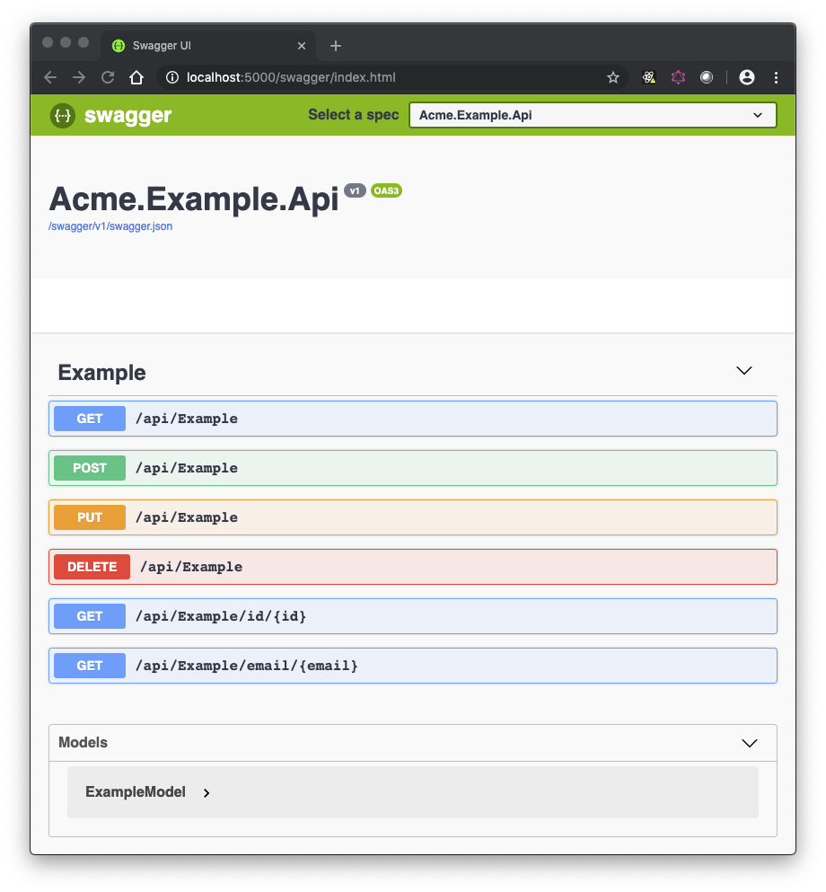

# Mcg.Webservice.Template.DDog

We at MCG are currently undergoing a focused effort to make our products and services cloud native. At this time our primary development language is C#.NET. Fortunately .NET Core’s support for cloud development is fairly robust; it supports containerization using Linux containers, and has a wide variety of APIs and libraries to support many of today's top open-source technologies.

When writing microservices using WebAPI and related technologies, one thing all services have in common are the following:

| **Requirement**                                            | **Technology Used**                                                                                                               | **Nuget Packages**                                                                                                                                                                                                                                                                                                                                      |
| ---------------------------------------------------------- | --------------------------------------------------------------------------------------------------------------------------------- | ------------------------------------------------------------------------------------------------------------------------------------------------------------------------------------------------------------------------------------------------------------------------------------------------------------------------------------------------------- |
| The solution needs to be containerized                     | [Docker](https://www.docker.com/products/docker-desktop)                                                                          | n/a                                                                                                                                                                                                                                                                                                                                                     |
| The solution needs to instrumented                         | [Prometheus](https://prometheus.io/) and [Grafana](https://grafana.com/)                                                          | [prometheus-net](https://www.nuget.org/packages/prometheus-net/)<br/>[prometheus-net.AspNetCore](https://www.nuget.org/packages/prometheus-net.AspNetCore/)                                                                                                                                                                                             |
| The solution requires a health-check endpoint              | [ASP.NET Core Api](https://docs.microsoft.com/en-us/aspnet/core/host-and-deploy/health-checks?view=aspnetcore-3.0)                | [Microsoft.AspNetCore.Diagnostics.HealthChecks](https://www.nuget.org/packages/Microsoft.AspNetCore.Diagnostics.HealthChecks/)                                                                                                                                                                                                                          |
| The solution needs robust structured logging               | [Serilog](https://serilog.net/)<br/>[Elasticsearch](https://www.elastic.co/)<br/>[Kibana](https://www.elastic.co/products/kibana) | [Serilog.AspNetCore](https://www.nuget.org/packages/Serilog.AspNetCore/)<br/>[Serilog.Extensions.Hosting](https://www.nuget.org/packages/Serilog.Extensions.Hosting/)<br/>[Serilog.Sinks.Console](https://www.nuget.org/packages/Serilog.Sinks.Console/)<br/>[Serilog.Sinks.Elasticsearch](https://www.nuget.org/packages/Serilog.Sinks.Elasticsearch/) |
| The solution requires distributed tracing                  | [OpenTracing](https://opentracing.io/)<br/>[Jaeger](https://www.jaegertracing.io/)                                                | [OpenTracing](https://www.nuget.org/packages/OpenTracing/)<br/>[OpenTracing.Contrib.NetCore](https://www.nuget.org/packages/OpenTracing.Contrib.NetCore/)<br/>[Jaeger](https://www.nuget.org/packages/Jaeger/)                                                                                                                                          |
| The solution should publish its API using an open standard | [OpenAPI](https://www.openapis.org/)<br/>[Swagger](https://swagger.io/)                                                           | [Swashbuckle.AspNetCore](Swashbuckle.AspNetCore)                                                                                                                                                                                                                                                                                                        |

Setting up this “infrastructure code”, or boilerplate, can be almost as time consuming as implementing the logic that solves the business problem itself! Not only that, getting that boilerplate implemented across all services consistently can be a real challenge, especially when you may have several scrum teams working on different projects at one time. Consistency in implementing these cross-cutting concerns is equally as important for your DevOps and SysOps teams.

## Some Prerequisites

### All Platforms

- Your development machine will need [.NET Core 3.1 SDK](https://dotnet.microsoft.com/download/dotnet-core/3.1).

- [Docker Desktop](https://www.docker.com/products/docker-desktop) for building and running the solution locally in a container.

- [Coverlet](https://github.com/tonerdo/coverlet?WT.mc_id=-blog-scottha#coverlet) for calculating code coverage when running the command `make test`

```shell
dotnet tool install --global coverlet.console
```

### Windows Only

- Ensure [Chocolatey](https://chocolatey.org/install) is installed. Chocolatey is a package manager for Windows and performs a similar function for it as Brew does for OSX, or APT or yum does for their respective Linux distros.
- After installing Chocolatey, install GNU Make:

```shell
choco install make
```

### Optional

- (OSX, Windows)[Visual Studio 2019](https://visualstudio.microsoft.com/vs/)
- (OSX, Windows, Linux)[Visual Studio Code](https://code.visualstudio.com/)

---

## Installing the template

1. Clone the repository into a location of your choice:

   ```shell
   git clone https://github.com/jeremyj01/mcg.webservice.template.cncf.git
   ```

2. Navigate to the template directory:

   ```shell
   cd mcg.webservice.template.cncf/template
   ```

3. Run the following command:

   ```shell
   dotnet new -i .
   ```

4. The template should now be installed as "MCG's ASP.NET Core Web API".

5. If you need to reset your templates back to default, you can run this command:

```shell
dotnet new --debug:reinit
```

---

## Creating a new solution

The template is a dotnet template, not a Visual Studio template. Therefore you create a new solution from the commandline. To create a new solution with the template use the following command:

```shell
dotnet new mcgwebsvc -o [desired solution root dir name] -n [solution name]
```

For example, the following command will create a new soltion named "Acme.Example" and place it in the "Acme.Example" directory:

```shell
dotnet new mcgcncf -o Acme.Example -n Acme.Example
```

The directory structure will look like this:

```shell
<your dir>\Acme.Example
├───Acme.Example.Api
│   ├───Connected Services
│   │   └───Application Insights
│   ├───Controllers
│   ├───DataAccess
│   ├───Infrastructure
│   │   ├───Configuration
│   │   ├───DependencyTracking
│   │   ├───HealthChecks
│   │   ├───Logging
│   │   └───Metrics
│   ├───Models
│   ├───Properties
│   └───Services
└───Acme.Example.UnitTests
    ├───ControllerTests
    ├───InfrastructureTests
    │   ├───ConfigurationTests
    │   ├───HealthCheckTests
    │   └───MetricsTests
    ├───MessagingTests
    └───ModelTests
```

---

## Run the solution

Note: You will need to run the DataDog Agent, and supply it with your API Key obtained from DataDog, if you wish to view the logs, metrics, and traces in DataDog.  For details on how to run the agent, refer to the [docker-compose.yaml](template/docker-compose.yml).

From the terminal run the command `make run`. You should see the following output:

```shell
make run
dotnet build Acme.Example.sln -c Debug --force --nologo
  Restore completed in 380.78 ms for /Users/.../Acme.Example.UnitTests/Acme.Example.UnitTests.csproj.
  Restore completed in 380.78 ms for /Users/.../Acme.Example.Api/Acme.Example.Api.csproj.
  Acme.Example.Api -> /Users/.../Acme.Example.Api/bin/Debug/netcoreapp3.0/Acme.Example.Api.dll
  Acme.Example.UnitTests -> /Users/.../Acme.Example.UnitTests/bin/Debug/netcoreapp3.0/Acme.Example.UnitTests.dll

Build succeeded.
    0 Warning(s)
    0 Error(s)

Time Elapsed 00:00:01.33
dotnet run -p Acme.Example.Api/Acme.Example.Api.csproj
[13:20:29 INF] Initialized Tracer(ServiceName=Mcg.Webservice, Version=CSharp-0.3.6.0, Reporter=RemoteReporter(Sender=UdpSender(UdpTransport=ThriftUdpClientTransport(Client=127.0.0.1:6831))), Sampler=ConstSampler(True), IPv4=167772263, Tags=[jaeger.version, CSharp-0.3.6.0], [hostname, Slartibartfast.local], [ip, 10.0.0.103], ZipkinSharedRpcSpan=False, ExpandExceptionLogs=False, UseTraceId128Bit=False)
[13:20:30 INF] Now listening on: http://localhost:5000
[13:20:30 INF] Application started. Press Ctrl+C to shut down.
[13:20:30 INF] Hosting environment: Production
[13:20:30 INF] Content root path: /Users/.../Acme.Example.Api
```

Open a browser of your choice and navigate to [http://localhost:5000/swagger](http://localhost:5000/swagger). Without writing any code, you should have a working app right out of the gate:



To run everything in a container, and to see all the logs, metrics, and traces pushed to DataDog, simply invoke the [docker-compose.yaml](template/docker-compose.yml).

Happy Coding!

---

## Contributing

Any contributions to help make this template feature-rich is always welcome! Follow these instructions - originally provided by [Marc Diethelm](https://github.com/MarcDiethelm), [Contributing.md](https://github.com/MarcDiethelm/contributing/blob/master/README.md):

### How to make a clean pull request

Look for a project's contribution instructions. If there are any, follow them.

- Create a personal fork of the project on Github.
- Clone the fork on your local machine. Your remote repo on Github is called `origin`.
- Add the original repository as a remote called `upstream`.
- If you created your fork a while ago be sure to pull upstream changes into your local repository.
- Create a new branch to work on! Branch from `develop` if it exists, else from `master`.
- Implement/fix your feature, comment your code.
- Follow the code style of the project, including indentation.
- If the project has tests run them!
- Write or adapt tests as needed.
- Add or change the documentation as needed.
- Squash your commits into a single commit with git's [interactive rebase](https://help.github.com/articles/interactive-rebase). Create a new branch if necessary.
- Push your branch to your fork on Github, the remote `origin`.
- From your fork open a pull request in the correct branch. Target the project's `develop` branch if there is one, else go for `master`!
- …
- If the maintainer requests further changes just push them to your branch. The PR will be updated automatically.
- Once the pull request is approved and merged you can pull the changes from `upstream` to your local repo and delete
  your extra branch(es).

And last but not least: Always write your commit messages in the present tense. Your commit message should describe what the commit, when applied, does to the code – not what you did to the code.
